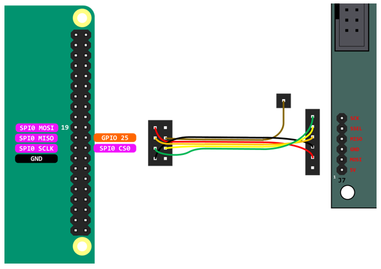
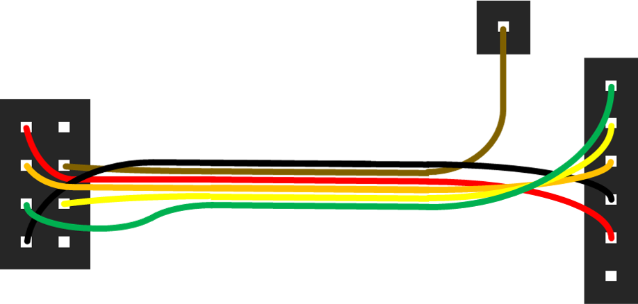
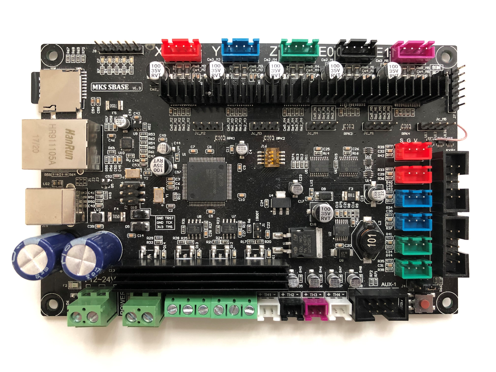
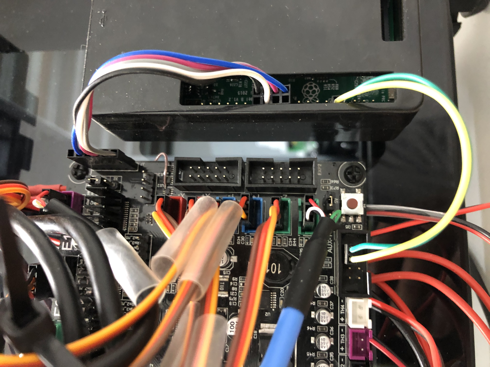

Mks-Sbase
=========

The MKS-SBASE has a level shifter in the SPI circuit and therefore the EXP1 connector cannot be used. However adding an onboard jumper allows the J7 header to be used instead. Solder a jumper between pin 4 on U11 to pin 2 on the J7 header.

Firmware and Config
-------------------

- Firmware for the MKS-SBASE is LPC1768

In your .hal file, you will need to configure the Remora chip_type to "LPC"

.. code-block::

		loadrt remora chip_type=LPC

Hardware Pins
-------------
Remora firmware has some features available only on specific hardware pins.

Available PWM Hardware pins:

-  2.0, 2.5, 1.18, 1.20, 1.21, 1.23, 1.24, 1.26, 3.25, 3.26

Available QEI Encoder Hardware pins:

- 1.20
- 1.23
- 1.24 is used as index

Wiring
------

Wiring requires the following components:

* 100mm Female-Female Dupont ribbon jumper
* 6 way (1x6) Dupont connector
* 8 way (2x4) Dupont connector
* 1 way Dupont connector

Images
------

.. image:: ../_static/MksSbase-jumper-top.jpg

.. image:: ../_static/MksSbase-jumper-bottom.jpg

    
	Mks-Sbase installed with Raspberry Pi. Note optional serial connection for debugging.

