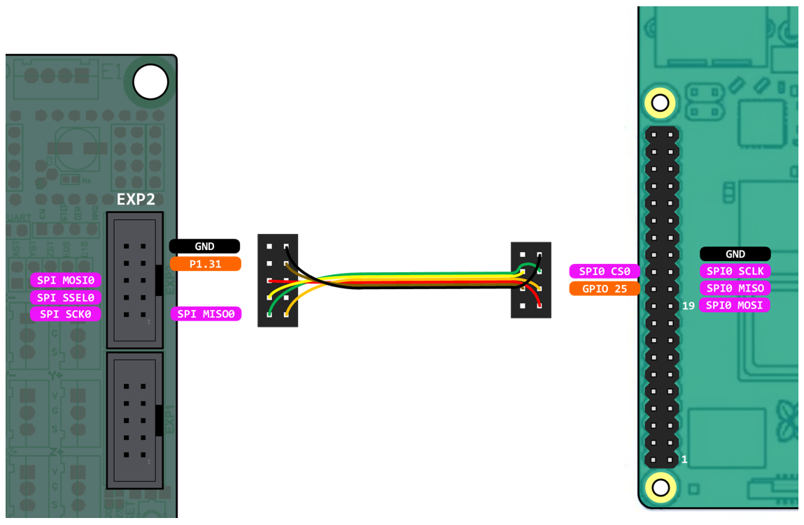

Bigtreetech SKR V1.3
====================

Wiring for the SKR boards is very straight forward with all pins directly available on the EXP2 header.

Wiring
------

Wiring requires the following components:

* 100mm Female-Female Dupont ribbon jumper
* 10 way (2x5) Dupont connector
* 8 way (2x4) Dupont connector

	
.. image:: ../_static/SKRv14-wiring-diag2.png
    :align: center