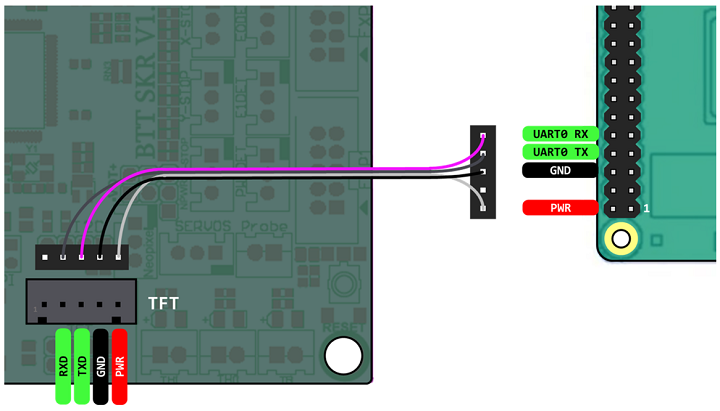

Bigtreetech SKR V1.4 and SKR V1.4 TURBO
====================
There are 2 types of SKR boards with different chips. The SKR 1.4 and the SKR1.4 TURBO

Wiring for the SKR boards is very straight forward with all pins directly available on the EXP2 header.

Firmware and Config
-------------------

- Firmware for the SKR V1.4 is LPC1768
- Firmware for the SKR V1.4 TURBO is LPC1769

In your .hal file, you will need to configure the Remora chip_type to "LPC"

.. code-block::

		loadrt remora_lpc chip_type=LPC

Hardware Pins
-------------
Remora firmware has some features available only on specific hardware pins.

Available PWM Hardware pins:

-  2.0, 2.5, 1.18, 1.20, 1.21, 1.23, 1.24, 1.26, 3.25, 3.26

Available QEI Encoder Hardware pins:

- 1.20
- 1.23
- 1.24 is used as index

Firmware and Config
-------------------

- Firmware for the SKR V1.4 is FirmwareBin/LPC1768
- Firmware for the SKR V1.4 TURBO is FirmwareBin/LPC1769

In your .hal file, you will need to configure the Remora chip_type to "LPC", aswell as load the remora_lpc component

.. code-block::

		loadrt remora_lpc chip_type=LPC

Wiring
------

Wiring requires the following components:

* 100mm Female-Female Dupont ribbon jumper
* 10 way (2x5) Dupont connector
* 8 way (2x4) Dupont connector

.. image:: ../_static/SKRv14-wiring-diag.png
    :align: center
	
.. image:: ../_static/SKRv14-wiring-diag2.png
    :align: center
	
To power the Raspberry Pi from the SKR V1.4 the follwoing components are requried:

* 150mm or 200mm Female-Female Dupont ribbon jumper
* 5 way (1x5) Dupont connector
* 5 way (1x5) Dupont connector
	

	
The diagram above includes the optional serial debug interface. Note that TX <-> RXD and RX <-> TXD.
