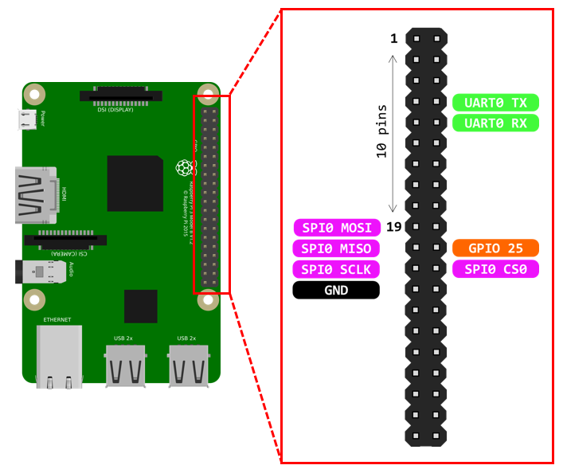
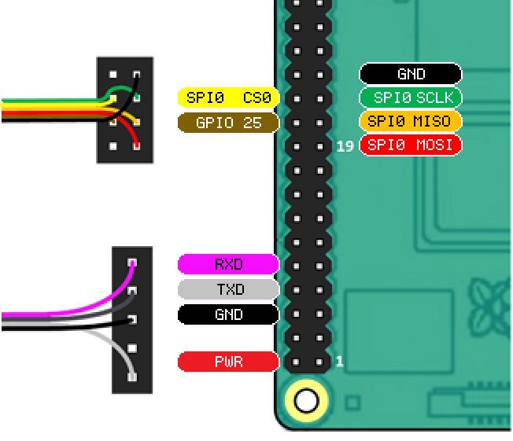

Remora SPI
========

Remora SPI is available with the Raspberry Pi SBC. As the hard realtime requirements are offloaded onto the controller board, Remora can run on RPi 3B, RPi 3B+, RPi 4B and RPi 5 versions.

Wiring to Raspberry Pi
----------------------

+--------------+-----------+------------------------+
| RPI PIN      | COLOR     | PIN DESCRIPTION        |
+--------------+-----------+------------------------+
| RPI_PIN_19   | RED       | MOSI when SPI0 in use  |
+--------------+-----------+------------------------+
| RPI_PIN_21   | ORANGE    |  MISO when SPI0 in use |
+--------------+-----------+------------------------+
| RPI_PIN_23   | GREEN     | CLK when SPI0 in use   |
+--------------+-----------+------------------------+
| RPI_PIN_24   | YELLOW    | CE0 when SPI0 in use   |
+--------------+-----------+------------------------+
| RPI_PIN_22   | BROWN     | PRU Reset  GPIO 25     |
+--------------+-----------+------------------------+
| RPI_PIN_10   | PURPLE    | RPI RXD                |
+--------------+-----------+------------------------+
| RPI_PIN_8    | GREY      | RPI TXD                |
+--------------+-----------+------------------------+

LinuxCNC Driver Information
---------------------------

| **LinuxCNC Driver:**      "remora-spi"
| **LinuxCNC Driver Source:**		https://github.com/cakeslob/Remora/tree/main/LinuxCNC/Components/Remora-spi

Controller Boards
-----------------

In general any controller board that is based on an LPC1768, LPC1769, STM32F407. STM32F429, or STM32F446 microcontroller can be used, provided that an SPI interface is available. "Smoothieware" compatible controller boards are common and include:

* Mks-Sbase V1.3 - Tested. Requires on board jumper to allow the J3 header connector to be used for SPI communication
* Bigtreetech SKR V1.3 - Tested
* Bigtreetech SKR V1.4 - Tested. For TURBO version use LPC1769 firmware version.
* Re-ARM - Under test
* Bigtreetech SKR V2.0 - Tested. STM32F407 and STM32F429 versions. 
* Bigtreetech Octopus v1.1 - Tested STM32F446.
* Bigtreetech Octopus PRO - Tested. STM32F429 and STM32F446 versions. 
* Fysetc Spider v2.2 - Tested with Mbed6 
* Mks-Monster8 v1 - Tested with Mbed6, no bootloader
* Expatria Technologies Flexi-HAL - Designed for SPI Remora and RPI integration.  https://github.com/Expatria-Technologies/remora-flexi-hal

.. toctree::
   :maxdepth: 2
   
   Mks-Sbase
   SKRV13
   SKRV14
   Re-ARM
   skrv2
   octopus
   monster8
   spider
   Flexi-HAL

