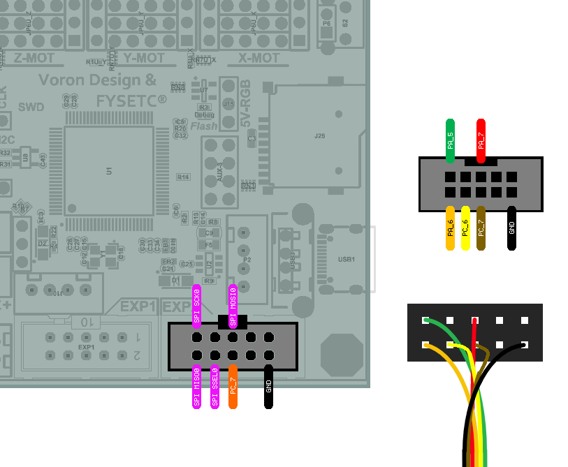
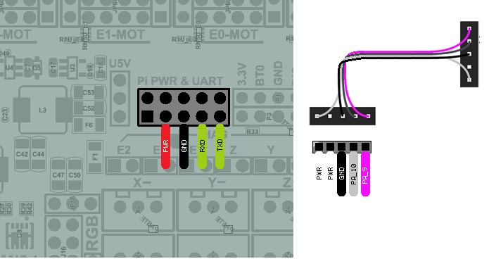

Fysetc Spider
====================

Wiring for the Spider board is very straight forward with all pins directly available on the EXP2 header.
	
Remora Details
--------------
| **Board:**   Fysetc Spider 2.2
| **MCU:**	STM32F446, 
| **Communication:**	SPI
| **Firmware:**	      STM32F446/SPIDER,  https://github.com/scottalford75/Remora/tree/main/Firmware/FirmwareBin
| **Firmware Source:**		https://github.com/scottalford75/Remora/tree/main/Firmware/FirmwareSource/Remora-OS6
| **LinuxCNC Driver:**      "remora-spi"
| **PRU Base Frequency:** 40000 - 80000
| **Supported Modules:**    

Firmware 
-------------------
The Spider uses an STM32F446, newer versions use an STM32H723 and is not supported.  

- Firmware for the Fysetc Spider is located under FirmwareBin/STM32F446/SPIDER

In your .hal file, you will need to load the Remora driver

.. code-block::

		loadrt remora-spi

Config
-------
A sample config.txt for the Fysetc Spider is located in the Remora repo under FIrmware/ConfigSamples/Fysetc_Spider

The config must be named config.txt and must be stored on the SD card. It must remain in the board. 

Hardware Pins
-------------
Remora firmware has some features available only on specific hardware pins. These pins can vary between STM32 boards.

Available PWM Hardware pins:

-  PA_1 PA_2 PA_3 PA_5 PA_6 PA_7 PA_8  PA_9 PA_10 PA_11 PA_15
- PB_0 PB_1 PB_3 PB_4 PB_5 PB_6 PB_7 PB_8 PB_9 PB_10 PB_11 PB_13 PB_14 PB_15
- PC_6 PC_7 PC_8 PC_9
- PE_5 PE_6 PE_8 PE_9 PE_10 PE_11

Available QEI Encoder Hardware pins:

- PE_9
- PE_11
- PE_13 is used as index

Wiring
------

Wiring requires the following components:

* 100mm Female-Female Dupont ribbon jumper
* 10 way (2x5) Dupont connector
* 8 way (2x4) Dupont connector

The pinout for the Fysetc Spider is slightly different than other versions. Please read the pinout carefully. 

+--------+----------+----------------------+-------------+
| PIN    | COLOR    |   FUNCTION  	   | RPI PIN     |
+--------+----------+----------------------+-------------+
| PA_7   | RED      | SPI_MOSI   	   | RPI_PIN_19  |
+--------+----------+----------------------+-------------+
| PA_6   | ORANGE   |  SPI_MISO 	   | RPI_PIN_21  | 
+--------+----------+----------------------+-------------+
| PA_5   | GREEN    | SPI_SCK		   | RPI_PIN_23  | 
+--------+----------+----------------------+-------------+
| PC_6   | YELLOW   |  SPI_SSEL  	   | RPI_PIN_24  | 
+--------+----------+----------------------+-------------+
| PC_7   | BROWN    | PRU Reset	  	   | RPI_PIN_22  | 
+--------+----------+----------------------+-------------+
| PA_9   | PURPLE   | MCU TX to RPI RXD    | RPI_PIN_10  |
+--------+----------+----------------------+-------------+
| PA_10  | GREY     | MCU RX to RPI TXD    | RPI_PIN_8   |
+--------+----------+----------------------+-------------+

	

SPIDER V2.2
	
To UART from the Raspberry Pi to the Spider the follwoing components are requried:

* 150mm or 200mm Female-Female Dupont ribbon jumper
* 5 way (1x5) Dupont connector
* 5 way (1x5) Dupont connector

	

The diagram above includes the optional serial debug interface. Note that TX <-> RXD and RX <-> TXD. The standard order for serial is different with the Fysetc Spider 2.2 , so please pay close attention to the wiring. 

- Note: The Spider had some issues on some versions with silkscreen and PWR/GND wiring. As the PWR/GND are not needs, it is recomended to not connect those unless you are sure of the pinout. 
