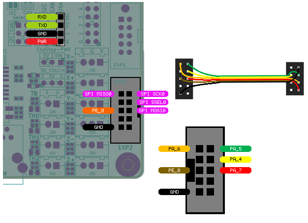
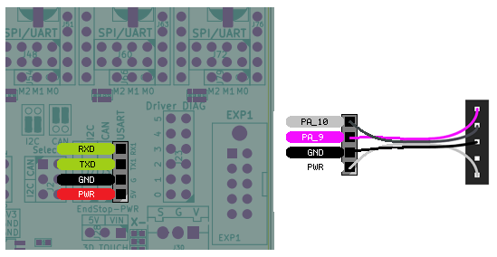

Makerbase Monster8
====================

Wiring for the MKS Monster8 boards is very straight forward with all pins directly available on the EXP2 header.

Firmware and Config
-------------------
The Monster8 uses an STM32F407. 

- Note: The MKS Monster8 firmware source is found in the MbedOS6 branch, as a working version for MbedOS5 could not be realised at the time of writing this. 

- Note: Firmware as of writing could not be made to work with bootloader, so firmware needs to be loaded via ST-LINK or DFU. If needed, the original bootloader can be found on the MKS Monster8 github page.

- Note: When loading frimware over USB DFU, use USB voltage to power the board, not motor power.  There appears to be issues with uploading via DFU and one of the heater mosfets

- Firmware for the MKS Monster8 is located under STM32F407/MKS_MONSTER8

In your .hal file, you will need to configure the Remora chip_type to "STM"

.. code-block::

		loadrt remora chip_type=STM

Hardware Pins
-------------
Remora firmware has some features available only on specific hardware pins. These pins can vary between STM32 boards.

Available PWM Hardware pins:

-  PA_1 PA_2 PA_3 PA_5 PA_6 PA_7 PA_8  PA_9 PA_10 PA_11 PA_15
- PB_0 PB_1 PB_3 PB_4 PB_5 PB_6 PB_7 PB_8 PB_9 PB_10 PB_11 PB_13 PB_14 PB_15
- PC_6 PC_7 PC_8 PC_9
- PD_12 PD_13 PD_14 PD_15
- PE_5 PE_6 PE_8 PE_9 PE_10 PE_11

Available QEI Encoder Hardware pins:

- PE_9
- PE_11
- PE_13 is used as index

Wiring
------
The wiring for both versions are the same, except UART is in a different location.
Wiring requires the following components:

* 100mm Female-Female Dupont ribbon jumper
* 10 way (2x5) Dupont connector
* 8 way (2x4) Dupont connector

The pinout for the Makerbase Monster8 is slightly different than other versions. Please read the pinout carefully. 

- PRU_RESET = PE_8
- SPI_SSEL  = PA_4
- SPI_SCK   = PA_5
- SPI_MISO  = PA_6
- SPI_MISO  = PA_7

	
To UART from the Raspberry Pi to the Monster8 the follwoing components are requried:

* 150mm or 200mm Female-Female Dupont ribbon jumper
* 5 way (1x5) Dupont connector
* 5 way (1x5) Dupont connector

  

The diagram above includes the optional serial debug interface. Note that TX <-> RXD and RX <-> TXD.
