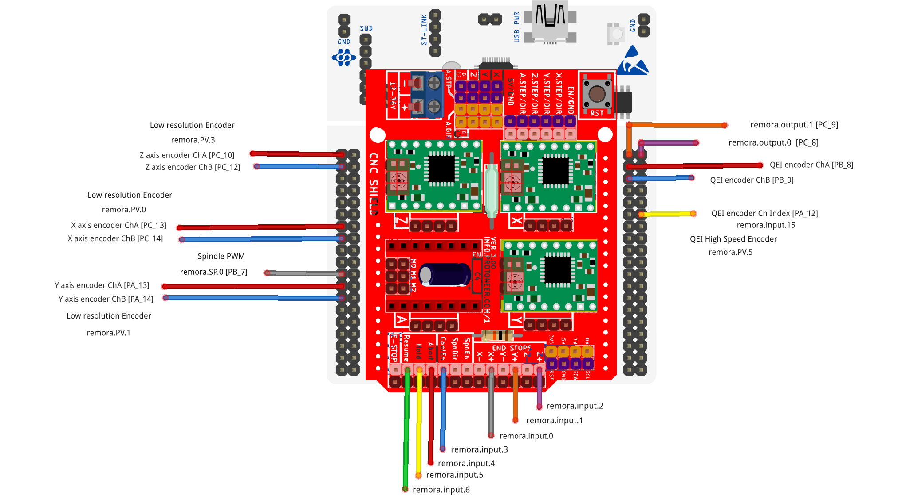

Nucleo64 F446 with GRBL 3.x CNC shield
====================

Nucleo64 F446 with GRBL/protoneer 3.x CNC shield with Remora firmware. 

	
.. image:: ../_static/nucleo446_cnc.png
    :align: center

Nucleo64-F446RE with Protoneer CNC shield 3.xx

This document covers running Remora firmware on LinuxCNC with a fixed configuration. This page is specific to the Nucleo64 F446RE hardware. The Firmware is special taylored to the Nucleo board running the STM32F446RE mcu with a grbl CNC shield v3.xx.

The config includes : 

* 4x stepgens for XYZA axis 
* 3x lower resolution encoders with channels A/B
* 1x Highspeed encoder for spindle or high resolution encoder
* 7x inputs for limit switches and buttons
* 2x outputs  
* 1x PWM
* Reset pin

Firmware and Config
-------------------

This firmware is specific to the Nucleo64 F446RE in combination with the classic grbl cnc shield. 

The config for the Nucleo/CNC shield is a static configuration based around the pinout of the grbl shield. This means the setup does not need an SD card to load the configuration, but it also cannot be changed. 
It is a static configuration, so to change any pinout, it would be required to compile firmware with adjustments. That will not be covered in the scope of this documentation at this time.  You do not need to use all the pins but they included in the firmware.

The Stepgens and limit switches are configured to match the pins on the grbl cnc shield. Hardware related configuration for the grbl shield may be required for some jumper related things. Pins not found on the grbl shield are found on the Nucleo Morpho headers. You do not need to use the pins on the cnc shield, you can use the morpho pins instead. 

+--------+------------------------------+----------------+
| PIN    |   FUNCTION  	 	  	| LinuxCNC PIN   |
+--------+------------------------------+----------------+
| PA_10  |	X AXIS STEP 		| remora.joint.0 |
+--------+------------------------------+----------------+
| PB_4   |	X AXIS DIR  		| remora.joint.0 | 
+--------+------------------------------+----------------+
| PB_3   | 	Y AXIS STEPGEN    	| remora.joint.1 | 
+--------+------------------------------+----------------+
| PB_10  |	Y AXIS DIR    		| remora.joint.1 | 
+--------+------------------------------+----------------+
| PB_5   | 	Z AXIS STEPGEN 		| remora.joint.2 | 
+--------+------------------------------+----------------+
| PA_8   |	Z AXIS DIR     	  	| remora.joint.2 | 
+--------+------------------------------+----------------+
| PA_6   |	A AXIS STEPGEN   	| remora.joint.3 |
+--------+------------------------------+----------------+
| PA_5   |	A AXIS DIR	 	| remora.joint.3 |
+--------+------------------------------+----------------+
| PA_9   | 	STEPPER ENABLE  	|		 | 
+--------+------------------------------+----------------+
| PC_13	 | X AXIS ENCODER CHANNEL A 	| remora.PV.0    | 
+--------+------------------------------+----------------+
| PC_14	 | X AXIS ENCODER CHANNEL B	| remora.PV.0 	 |
+--------+------------------------------+----------------+
| PA_13  | Y AXIS ENCODER CHANNEL A	| remora.PV.1  	 |
+--------+------------------------------+----------------+
| PA_14  | Y AXIS ENCODER CHANNEL B 	| remora.PV.1  	 | 
+--------+------------------------------+----------------+
| PC_10  | Z AXIS ENCODER CHANNEL A 	| remora.PV.2    | 
+--------+------------------------------+----------------+
| PC_12  | Z AXIS ENCODER CHANNEL B 	| remora.PV.2    | 
+--------+------------------------------+----------------+
| PB_8   | QEI  ENCODER CHANNEL A	| remora.PV.5    | 
+--------+------------------------------+----------------+
| PB_9   | QEI ENCODER CHANNEL B	| remora.PV.5    | 
+--------+------------------------------+----------------+
| PA_12  | QEI ENCODER CHANNEL INDEX	| remora.input.15| 
+--------+------------------------------+----------------+
| PB_7   | PWM OUTPUT 			| remora.SP.0  	 | 
+--------+------------------------------+----------------+
| PC_7   | X-LIMIT			| remora.input.0 |
+--------+------------------------------+----------------+
| PB_6   | Y-LIMIT 			| remora.input.1 |
+--------+------------------------------+----------------+
| PA_7   | Z-LIMIT			| remora.input.2 |
+--------+------------------------------+----------------+
| PB_0   | COOLANT			| remora.input.3 |
+--------+------------------------------+----------------+
| PA_0   | ABORT			| remora.input.4 |
+--------+------------------------------+----------------+
| PA_1   | HOLD				| remora.input.5 |
+--------+------------------------------+----------------+
| PA_4   | RESUME			| remora.input.6 |
+--------+------------------------------+----------------+
| PB_8   | OUTPUT 0			| remora.output.0|
+--------+------------------------------+----------------+
| PB_9   | OUTPUT 1			| remora.output.1|
+--------+------------------------------+----------------+

Wiring
------

Wiring requires the following components:

* 100mm Female-Female Dupont ribbon jumper
* 6 way (1x6) Dupont connector
* 8 way (2x4) Dupont connector

+--------+----------+----------------------+-------------+
| PIN    | COLOR    |   FUNCTION  	   | RPI PIN     |
+--------+----------+----------------------+-------------+
| PB_15  | RED      | SPI_MOSI   	   | RPI_PIN_19  |
+--------+----------+----------------------+-------------+
| PB_14  | ORANGE   | SPI_MISO  	   | RPI_PIN_21  | 
+--------+----------+----------------------+-------------+
| PB_13  | GREEN    | SPI_SCK		   | RPI_PIN_23  | 
+--------+----------+----------------------+-------------+
| PB_1   | YELLOW   | SPI_SSEL  	   | RPI_PIN_24  | 
+--------+----------+----------------------+-------------+
| PB_2   | BROWN    | PRU Reset	  	   | RPI_PIN_22  | 
+--------+----------+----------------------+-------------+
| GND    | BLACK    | GROUND	   	   | GND         | 
+--------+----------+----------------------+-------------+
| USB    | 	    | MCU TX to RPI RXD    | USB	 |
+--------+----------+----------------------+-------------+
| USB    | 	    | MCU RX to RPI TXD    | USB	 |
+--------+----------+----------------------+-------------+

.. image:: ../_static/nucleo446_pi.png
    :align: center
Nucleo connected to Raspberry Pi 4
	
.. image:: ../_static/nucleo446_sch.png
    :align: center
Nucleo to Raspberry Pi 4 schmatic

	
To UART from the Raspberry Pi to the Nucleo, you can use the usb port on the Nucleo to RPI usb

