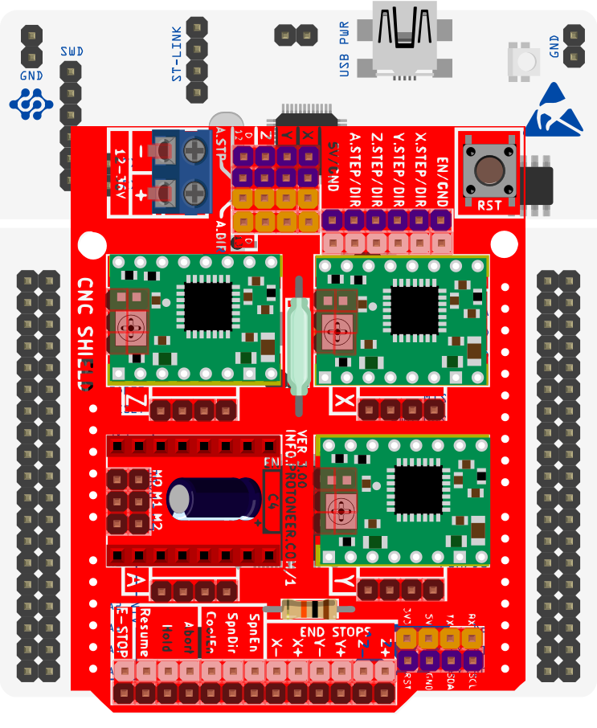
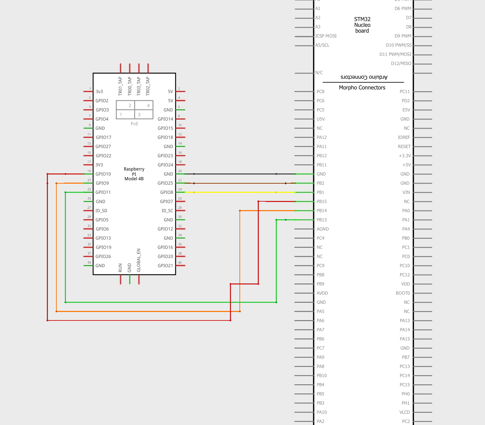

Nucleo64 F446 with GRBL 3.x CNC shield
====================

Nucleo64 F446 with GRBL/protoneer 3.x CNC shield with Remora firmware. 

	

Nucleo64-F446RE with Protoneer CNC shield 3.xx

Firmware and Config
-------------------

This firmware is specific to the Nucleo64 F446RE in combination with the classic grbl cnc shield. 

The config for the Nucleo/CNC shield is a static configuration based around the pinout of the grbl shield. This means the setup does not need an SD card to load the configuration, but it also cannot be changed. 
It is a static configuration, so to change any pinout, it would be required to compile firmware with adjustments. That will not be covered in the scope of this documentation at this time.  

This firmware configuration is currently limited. The config included 4x stepgens, and 3x inputs for limit switches. 

The Stepgens and limit switches are configured to match the pins on the cnc shield, 

Wiring
------

Wiring requires the following components:

* 100mm Female-Female Dupont ribbon jumper
* 6 way (1x6) Dupont connector
* 8 way (2x4) Dupont connector

+--------+----------+----------------------+-------------+
| PIN    | COLOR    |   FUNCTION  	   | RPI PIN     |
+--------+----------+----------------------+-------------+
| PB_15  | RED      | SPI_MOSI   	   | RPI_PIN_19  |
+--------+----------+----------------------+-------------+
| PB_14  | ORANGE   | SPI_MISO  	   | RPI_PIN_21  | 
+--------+----------+----------------------+-------------+
| PB_13  | GREEN    | SPI_SCK		   | RPI_PIN_23  | 
+--------+----------+----------------------+-------------+
| PB_1   | YELLOW   | SPI_SSEL  	   | RPI_PIN_24  | 
+--------+----------+----------------------+-------------+
| PB_2   | BROWN    | PRU Reset	  	   | RPI_PIN_22  | 
+--------+----------+----------------------+-------------+
| GND    | BLACK    | GROUND	   	   | GND         | 
+--------+----------+----------------------+-------------+
| USB    | PURPLE   | MCU TX to RPI RXD    | RPI_PIN_10  |
+--------+----------+----------------------+-------------+
| USB    | GREY     | MCU RX to RPI TXD    | RPI_PIN_8   |
+--------+----------+----------------------+-------------+

.. image:: ../_static/nucleo446_pi.png
    :align: center
Nucleo connected to Raspberry Pi 4
	

Nucleo to Raspberry Pi 4 schmatic

	
To UART from the Raspberry Pi to the Nucleo, you can use the usb port on the Nucleo to RPI usb

