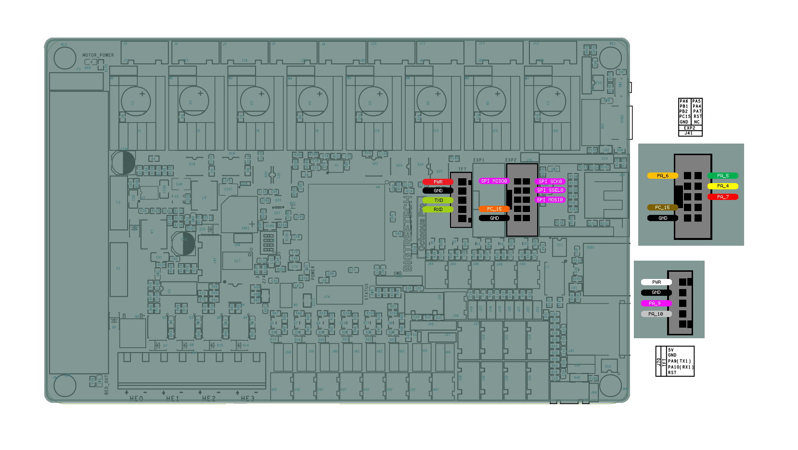
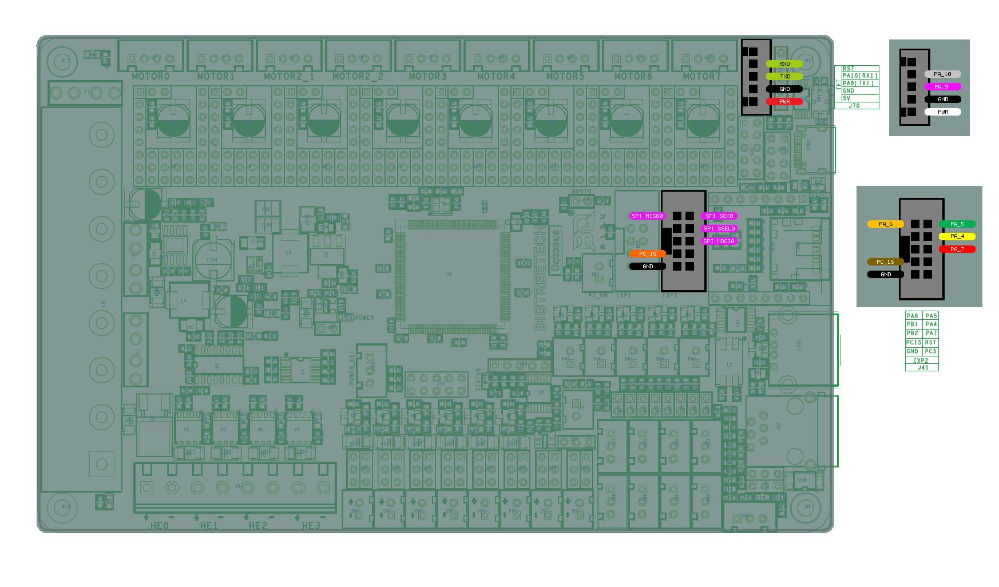
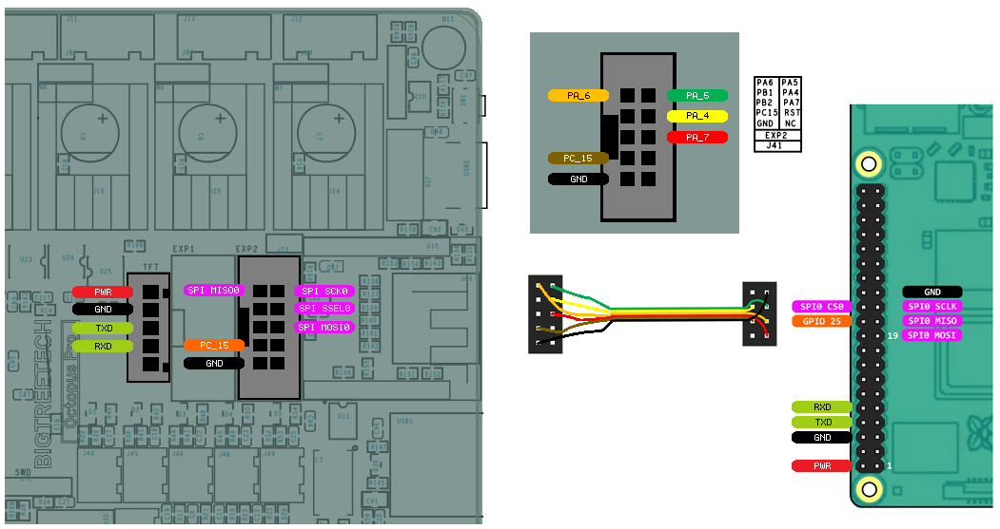
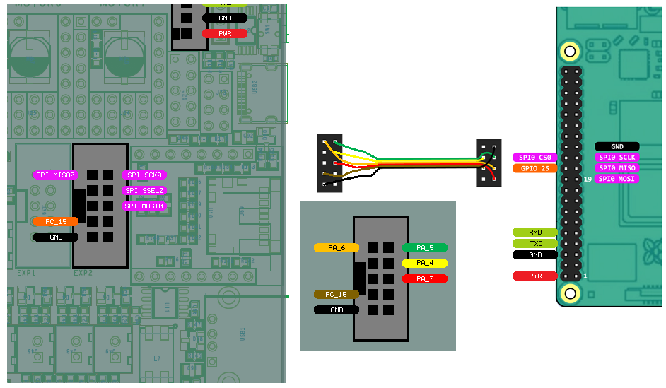
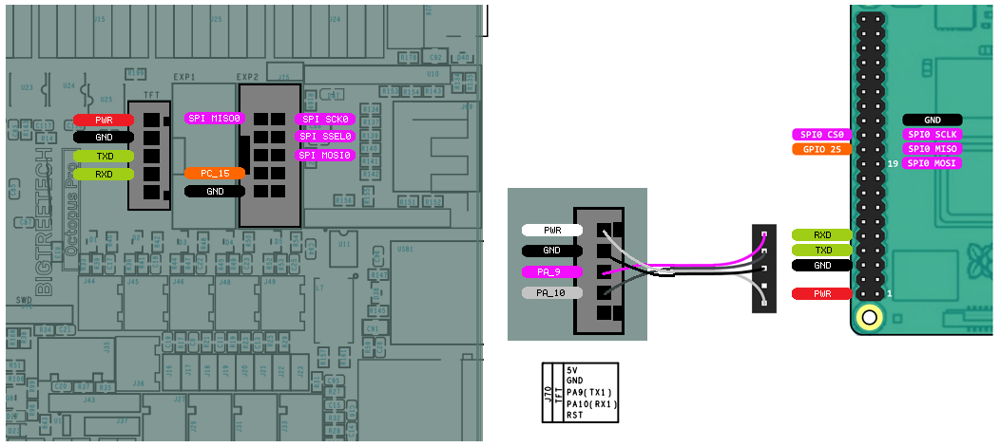
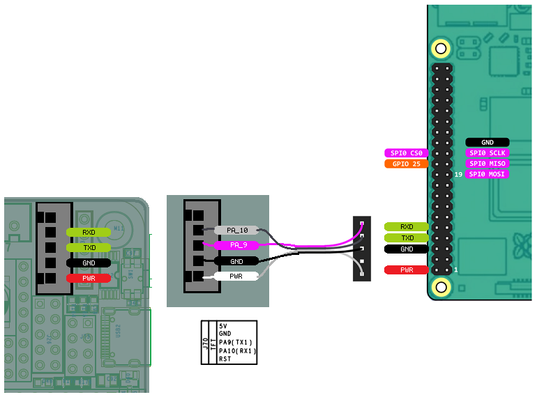

Bigtreetech Octopus
====================

Wiring for the Octopus boards is very straight forward with all pins directly available on the EXP2 header.

OCTOPUS PRO
	

OCTOPUS v1.1

Firmware and Config
-------------------
The Octopus has 2 different versions, earlier versions used a STM32F446 and newer versions use both the STM32F429 and STM32F446.
Hardware wise they are mostly the same, but they require diferent firmware. Note which board version you have and choose
the matching firmware. The 446 version of the firmware overwrites the bootloader, so firmware updates afterwards need to be done with 
STLINK or the DFU boot via USB-c.

The config for the Octopus will be the same for both versions. 

Wiring
------

Wiring requires the following components:

* 100mm Female-Female Dupont ribbon jumper
* 10 way (2x5) Dupont connector
* 8 way (2x4) Dupont connector

OCTOPUS PRO
	

OCTOPUS v1.1
	
To UART from the Raspberry Pi to the Octopus the follwoing components are requried:

* 150mm or 200mm Female-Female Dupont ribbon jumper
* 5 way (1x5) Dupont connector
* 5 way (1x5) Dupont connector

  
OCTOPUS PRO  
	

    
OCTOPUS v1.1

The diagram above includes the optional serial debug interface. Note that TX <-> RXD and RX <-> TXD.
