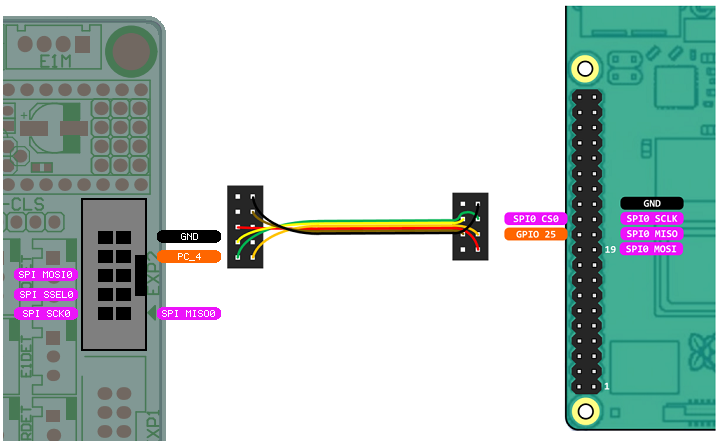
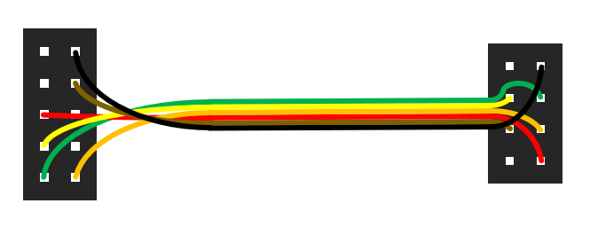
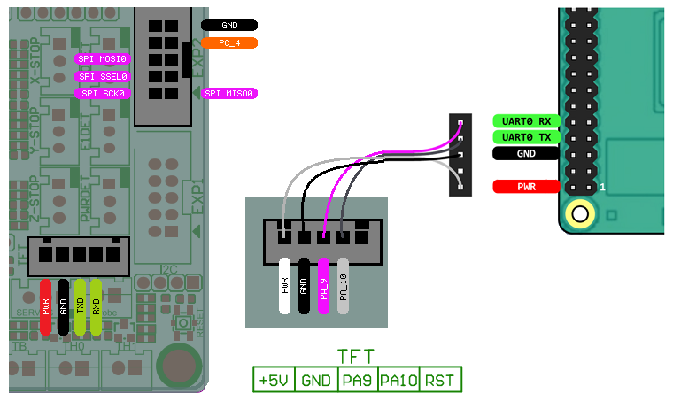

Bigtreetech SKR V2.0
====================

Wiring for the SKR boards are very straight forward with all pins directly available on the EXP2 header.

The SKR V2.0 can also power the Raspberry Pi from the TFT connector.

Firmware and Config
-------------------
The SKR V2.0 has 2 different versions, earlier versions used a STM32F407 and newer versions use the STM32F429.
Hardware wise they are the same, but they require diferent firmware. Note which board version you have and choose
the matching firmware.

The config for the SKR2 v2 will be the same for both versions. The SKR2 V2 has a motor power enable feature 
and needs to be included in the config. 

.. code-block::

	{
	"Thread": "On load",
	"Type": "Motor Power",
	"Comment": "Enable motor power SKR2",
	"Pin": "PC_13"
	}

Wiring
------

Wiring requires the following components:

* 100mm Female-Female Dupont ribbon jumper
* 10 way (2x5) Dupont connector
* 8 way (2x4) Dupont connector

	

	
To power the Raspberry Pi from the SKR V2.0 the follwoing components are requried:

* 150mm or 200mm Female-Female Dupont ribbon jumper
* 5 way (1x5) Dupont connector
* 5 way (1x5) Dupont connector
	

	
The diagram above includes the optional serial debug interface. Note that TX <-> RXD and RX <-> TXD.

