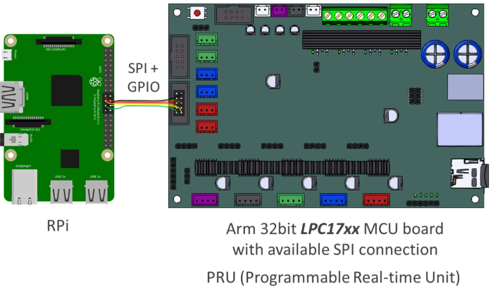

Welcome to Remora's  documentation
================================================

Remora is a free, opensource LinuxCNC component and Programmable Realtime Unit (PRU) firmware to allow STM32F4 and LPC17xx micro-controller "Smoothieboard" compatible controller boards to be used in conjuction with a Raspberry Pi to implement a LinuxCNC based CNC controller.

The documentation is divided into sections specificly relating to:

* **Introduction** - why Remora? What it is and how LinuxCNC works with an inexpensive controller board
* **Hardware** - connecting a Raspberry Pi to compatible controller boards
* **Software** - installing, setting up and configuring LinuxCNC on a Raspberry Pi to use the Remora component
* **Firmware** - installing and configuring the Remora firmware
* **Development** - contributing to the development of the Remora firmware and LinuxCNC component

.. code-block::

	Remora
	│
	└───Remora SPI
	│	└───Controller Board
	│	│	└───Firmware
	│	│	└───Config Samples
	│	└───LinuxCNC
	│		└───Components
	│		└───Config Samples
	│
	└───Remora Ethernet
		└───Controller Board
		│	└───Firmware
		│	└───Config Samples
		└───LinuxCNC
			└───Components
			└───Config Samples

.. toctree::
   :maxdepth: 2
   :hidden:
   :caption: Introduction
   
   /intro/intro
   

.. toctree::
   :maxdepth: 2
   :hidden:
   :caption: Hardware
   
   /hardware/hardware

.. toctree::
   :maxdepth: 2
   :hidden:
   :caption: Software
   
   /software/software

.. toctree::
   :maxdepth: 2
   :hidden:
   :caption: Firmware

   /firmware/firmware
   
.. toctree::
   :maxdepth: 2
   :hidden:
   :caption: Configuration

   /configuration/configuration

.. toctree::
   :maxdepth: 2
   :hidden:
   :caption: Development Guide
   
   /development/development
