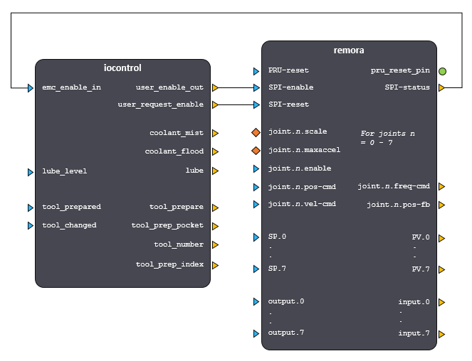

LinuxCNC configuration
======================

Sample Configuration Files
---------------------------
Sample LinuxCNC configuration files can be found in the Remora/LinuxCNC/ConfigSamples directory.
To copy all the samples into your LinuxCNC configuration for experimentation or customizing do the following on the rPi in a terminal window:

.. code-block::

	cp -a ~/linuxcnc/Remora/LinuxCNC/ConfigSamples/* ~/linuxcnc/configs

When you next start LinuxCNC you will find these items under the "My Configurations" node of the LinuxCNC Configuration Selector window.

Understanding the LinuxCNC configuration 
----------------------------------------

The following sections give some further details regarding the purpose and function of the different portions of the configuration files.

Loading realtime components
~~~~~~~~~~~~~~~~~~~~~~~~~~~

Along with the standard realtime components (kinematics and motion module) the Remora component needs to be loaded. This will expose the pins and allow the Remora functions to be added to the servo thread.

.. code-block::

    # load the realtime components

	loadrt [KINS]KINEMATICS
	loadrt [EMCMOT]EMCMOT base_period_nsec=[EMCMOT]BASE_PERIOD servo_period_nsec=[EMCMOT]SERVO_PERIOD num_joints=[KINS]JOINTS

	loadrt remora

E-Stop Loop
~~~~~~~~~~~

To alert and stop LinuxCNC if SPI communication with the controller board cannot be estabilished, or if it is lost during operation, the Remora component is included as part of the LinuxCNC E-Stop loop. The HAL configuration is shown below.

.. code-block::

    # estop loopback, SPI comms enable and feedback

    net user-enable-out     <= iocontrol.0.user-enable-out      => remora.SPI-enable
    net user-request-enable <= iocontrol.0.user-request-enable  => remora.SPI-reset
    net remora-status       <= remora.SPI-status                => iocontrol.0.emc-enable-in

Diagramatically this is shown in the following figure.

Adding functions to threads
~~~~~~~~~~~~~~~~~~~~~~~~~~~

The servo thread is used to communicate with the controller board and perform motion calculations. Functions are added in the order of execution. Firstly data is read from the controller board *(remora.read)*, motion is then computed, stepper frequencies are calculated *(remora.update-freq)* and then the data is written to the controller board *(remora.write)*.

.. code-block::

    # add the remora and motion functions to threads

	addf remora.read servo-thread
	addf motion-command-handler servo-thread
	addf motion-controller servo-thread
	addf remora.update-freq servo-thread
	addf remora.write servo-thread
